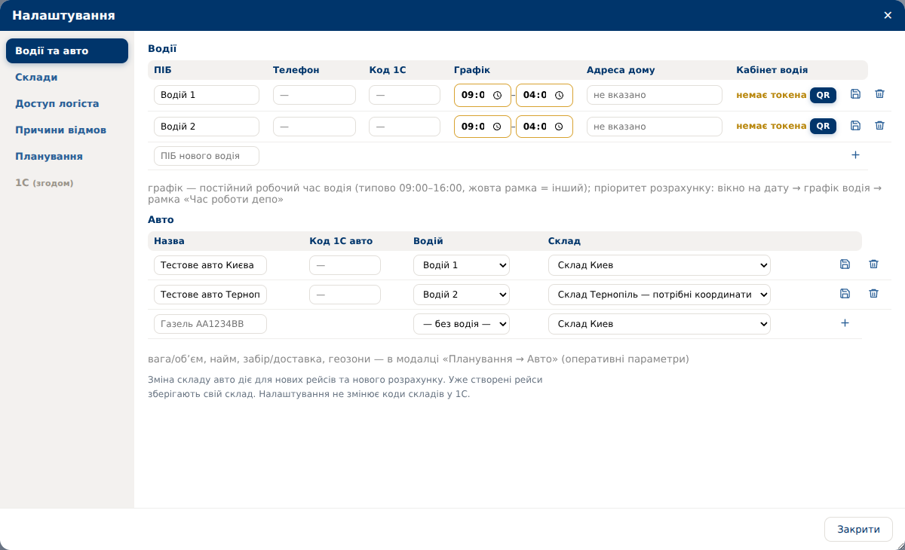

# TMS v91 — Київ і Тернопіль в одному проєкті

База: v90, commit `a6963a0`. Оновлення лише TMS; APK оновлювати не потрібно.

## Що змінено

- Додано внутрішній склад «Склад Тернопіль»: Україна, Тернопільська обл., с. Біла, вул. Мазепи, 24Д.
- У налаштуваннях авто додано поле «Склад». Наявні автомобілі зберігають попереднє закріплення.
- У розділі «Склади» можна змінити адресу, знайти її, уточнити точку на карті та підтвердити координати.
- Один логіст планує спільний проєкт. Виїзд, повернення, кілометраж і час кожного нового рейсу рахуються від складу відповідного авто.
- Розподіл спільних заявок враховує дорожній час, місткість, часові вікна та налаштовані геозони. Автоматичного поділу за товарними залишками чи складськими кодами 1С немає.
- Перепризначення складу авто впливає на нові рейси та новий розрахунок. У вже створеному рейсі його склад зберігається; заміна на авто іншого складу супроводжується попередженням.
- Геометрія нових маршрутів отримується до заміни збереженого плану; зміни рейсів записуються однією транзакцією.

`api/app/integration_1c.py`, формат XML та правила кодів складу 1С не змінювалися. Внутрішнє закріплення за Тернополем не підміняє код складу проєкту в обміні.

## Перше налаштування

1. Відкрити «Налаштування → Склади → Склад Тернопіль → Адреса і точка на карті».
2. Натиснути «Знайти», перевірити точний в'їзд на склад, за потреби пересунути маркер або ввести координати. Натиснути «Підтвердити точку і зберегти».
3. У «Налаштування → Водії та авто» вибрати потрібному автомобілю «Склад Тернопіль» і зберегти рядок.
4. Вибрати автомобілі обох складів для планування спільного проєкту й виконати розрахунок. Перевірити розподіл перед активацією.

Точні координати будівлі не вигадані: новий склад спочатку очікує підтвердження. Пошук і клік на карті лише показують попередній результат; без збереження координати не змінюються. Розрахунок із непідтвердженим складом блокується до зміни маршрутів.



## Встановлення

Скопіювати архів з локального комп'ютера:

```bash
scp tms-v91.zip root@128.140.34.164:/opt/
```

На сервері зробити резервну копію БД і встановити оновлення:

```bash
set -e
cd /opt/tms
backup_file="/opt/tms-before-v91-$(date +%Y%m%d-%H%M%S).dump"
docker compose exec -T db pg_dump -U tms -d tms -Fc > "$backup_file"
test -s "$backup_file"
cd /opt && unzip -o tms-v91.zip
cd /opt/tms && git diff --stat
docker compose up -d --build api
git add -A && git commit -m "v91: multi-depot planning for Kyiv and Ternopil" && git push
```

Міграція `033` застосовується автоматично при старті API. Повторне застосування не дублює склад і не скидає підтверджені координати. Після запуску оновити сторінку TMS.

## Перевірено

- 31 автоматичний тест: включно з реальним OR-Tools, обома складами, коефіцієнтами руху, ручним рейсом, зміною закріплення авто, відмовою OSRM та незмінністю XML при зміні лише внутрішнього складу.
- Повторне застосування міграції на PostgreSQL (PGlite): без дублювання, зі збереженням координат і складів наявних авто.
- Chromium на тестових даних: збереження складу авто, пошук адреси, клік на карті, підтвердження координат, повторне відкриття; без помилок JavaScript.
- Синтаксис Python і JavaScript, `git diff --check`.

Перевірки виконано локально на тестових даних. Оновлення не встановлювалося на робочий сервер; живий обмін з 1С не запускався.

## Текст для Viber

TMS v91: додано планування зі складів Київ і Тернопіль в одному проєкті. Логіст може закріплювати авто за складом у налаштуваннях; маршрути враховують виїзд і повернення на цей склад. Перед першим розрахунком потрібно підтвердити точку Тернопільського складу на карті. Обмін з 1С не змінювався. Оновлення APK не потрібне.
