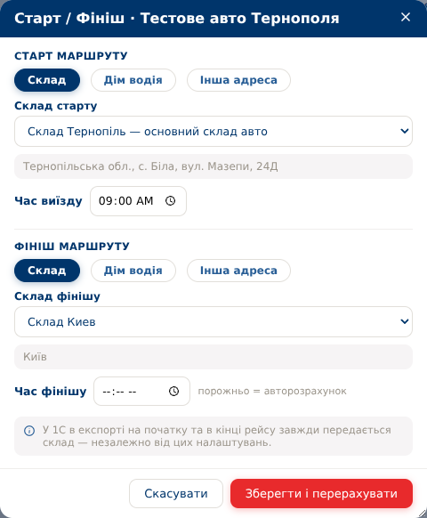

# TMS v92 — вибір складів старту та фінішу

База: актуальна v91, commit `14c891b`. Повний архів `tms-v92.zip`, коренева папка `tms/`.

## Виправлення

Раніше вкладка «Склад» у вікні «Старт / Фініш» лише показувала базовий склад рейсу. Тепер для старту та фінішу доступні окремі списки всіх складів, зокрема Тернополя.

- Основний склад поточного автомобіля стоїть першим у списку та позначений «основний склад авто».
- Якщо окремий склад точки ще не збережений, він пропонується за замовчуванням. Уже збережений ручний вибір зберігається при повторному відкритті, навіть якщо основний склад авто змінився.
- Для виїзду та повернення можна вибрати різні склади.
- Вибрані точки використовуються для перерахунку геометрії, кілометражу та часу. Назва складу відображається у точках рейсу, план/факті та кабінеті водія.
- Склад без підтверджених координат видимий у списку з підказкою, але збереження такої точки заблоковане.
- Варіанти «Дім водія» та «Інша адреса» збережені. Натискання «Скасувати» не змінює рейс.
- Збереження точок та перерахунок виконуються однією транзакцією: помилка OSRM не залишає рейс із частково оновленими даними.

Збережені точки — знімок назви та координат на момент підтвердження. Оновлення адреси складу в налаштуваннях не переписує автоматично вже збережені точки рейсів.

Код `integration_1c.py`, формат XML та складські коди 1С не змінювалися. Основний `routes.depot_id` і закріплення автомобіля також не змінюються при виборі старту/фінішу. Фактичні планові кілометри й час експортуються за чинними правилами.

APK оновлювати не потрібно. Після встановлення оновіть сторінку TMS; водіям достатньо повторно відкрити застосунок.



## Як скористатися

1. Відкрити редагування старту/фінішу потрібного рейсу.
2. Натиснути «Склад» у секції старту та/або фінішу.
3. Перевірити запропонований основний склад авто або вибрати інший зі списку.
4. Натиснути «Зберегти і перерахувати».

## Встановлення

З локального комп'ютера:

```bash
scp tms-v92.zip root@128.140.34.164:/opt/
```

На сервері — резервна копія перед автоматичною міграцією:

```bash
set -e
cd /opt/tms
backup_file="/opt/tms-before-v92-$(date +%Y%m%d-%H%M%S).dump"
docker compose exec -T db pg_dump -U tms -d tms -Fc > "$backup_file"
test -s "$backup_file"
cd /opt && unzip -o tms-v92.zip
cd /opt/tms && git diff --stat
docker compose up -d --build api
git add -A && git commit -m "v92: warehouse selection for route start and finish" && git push
```

Міграція `034` додає два необов'язкові посилання на склади старту/фінішу. Застосовується автоматично при запуску API; повторне застосування безпечне, старі маршрути не переписуються.

## Перевірки

- 38 автоматичних тестів пройдено, включно з вибором різних складів, геометрією та часом, сумісністю старих запитів, переходом на дім/іншу адресу, відхиленням невалідного складу та відкотом після помилки OSRM.
- Перевірка XML: вибір внутрішніх складів не змінює структуру чи код складу 1С.
- PostgreSQL/PGlite: повторна міграція, збереження вибору, зовнішні ключі, відкіт транзакції.
- Chromium: основний склад авто, обидва варіанти у списку, незалежне збереження, повторне відкриття, скасування, непідтверджені координати та помилка завантаження. Без помилок JavaScript.
- Перевірка синтаксису Python/JavaScript і `git diff --check`.

Перевірки виконано на тестових даних. Оновлення не встановлювалося на робочий сервер; живий обмін з 1С не запускався.

## Повідомлення для Viber

TMS v92: у вікні «Старт / Фініш» можна окремо вибрати склад виїзду та повернення, зокрема Тернопіль. За замовчуванням пропонується основний склад авто, збережений вибір не скидається. Обмін з 1С не змінювався. Оновлення APK не потрібне — достатньо повторно відкрити застосунок.
